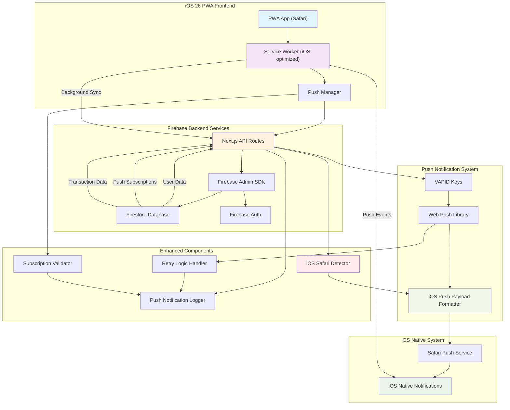

# iOS 26 PWA Backend Architecture for Push Notifications

## Architecture Overview

This document outlines the redesigned backend architecture specifically optimized for iOS 26 PWA push notifications.

## System Architecture Diagram

## Key Components

### 1. iOS Safari Detector
- Detects iOS Safari browser
- Applies iOS-specific push notification logic
- Handles iOS PWA installation requirements

### 2. iOS Push Payload Formatter
- Formats push notifications for iOS Safari compatibility
- Ensures proper notification structure and metadata
- Handles iOS-specific notification actions

### 3. Enhanced Service Worker
- iOS-optimized push event handling
- Proper notification display for iOS
- Background sync capabilities

### 4. Push Notification Logger
- Comprehensive logging for debugging
- Tracks push notification success/failure rates
- Monitors iOS-specific issues

### 5. Retry Logic Handler
- Handles failed push notifications
- Implements exponential backoff
- Manages subscription cleanup

## Data Flow

1. **User Action**: User performs transaction in PWA
2. **Detection**: System detects iOS Safari and applies iOS-specific logic
3. **Processing**: API processes transaction and prepares push notification
4. **Formatting**: Push payload is formatted for iOS compatibility
5. **Delivery**: Notification is sent via Safari Push Service
6. **Display**: Native iOS notification is displayed to user
7. **Logging**: All steps are logged for debugging and monitoring

## iOS 26 Specific Considerations

- PWA must be installed (added to home screen)
- Service worker must be properly registered and active
- Push subscription requires correct VAPID key format
- Notifications must use iOS-compatible payload structure
- Error handling for iOS-specific failure modes